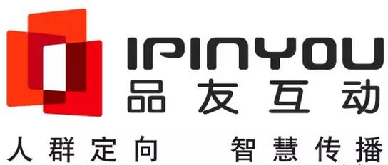
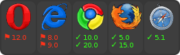

## 目录  
* [项目背景](#项目背景) 
* [浏览器支持](#浏览器支持)  
* [项目的基础结构](#项目的基础结构)  
* [项目的特色应用](#项目的特色应用) 
* [项目的部署运行](#项目的部署运行)  
  * [获取代码](#获取代码)  
  * [本地配置](#本地配置)  
  * [使用Api接口](#使用Api接口)  
       * [接口介绍](#接口介绍)  
       * [使用样例](#使用样例)  
 * [路由配置](#路由配置)
* [项目的发展方向](#项目的发展方向)  
* [相关文档链接](#相关文档链接)  
* [有问题反馈](#有问题反馈) 
* [版权许可证](#版权许可证)  

<a name="项目背景"></a>  

##项目背景

北京品友互动信息技术有限公司（简称品友互动），创立于2008年，是中国领先的基于大数据技术的人工智能平台，是最早将程序化购买引入中国的企业之一。

pyff-vue的设计初衷是品友互动给大家提供一个更方便的vue前端框架。

本项目在Element UI基础上构建，在路由、自动化、缓存组件上有了很大的突破。另外我们的组件文档给前端爱好者提供了更丰富更实用的功能。

<a name="浏览器支持"></a>  

##浏览器支持

Modern browsers and IE 10+。

[](https://ci.testling.com/substack/quote-stream)


<a name="项目的基础结构"></a>  

##项目的基础结构

* build - webpack config files
* config - webpack config files
* dist - build
* document - 组件文档
* src -your app
    * api
    * assets
    * common
    * components - your vue components
    * mock
    * styles
    * views - your pages
    * vuex
    * App.vue
    * main.js - main file
    * routes.js
* static - static assets

<a name="项目的特色应用"></a> 

##项目的特色应用
``` bash

1. 简洁轻量
    
    pyff-vue核心部分仅几兆,目录结构一目了然

2. 构建快速
    
    构建项目简单迅速，新手简单易学，上手快
  
3. 数据驱动
    
    驱动应用的数据源，以声明方式将数据源映射到视图  

4. 模块友好
    
    模块清晰，分工明确，低耦合，高内聚

5. 组件化
    
    组件化明确，完全有能力驱动采用单文件组件来开发的更为复杂的单页应用     

```
<a name="项目的部署运行"></a>  

##项目的部署运行

<a name="获取代码"></a> 

###获取代码
    
* GitLab:[http://gitlab.ipinyou.com/js/pyff-vue/tree/master](http://gitlab.ipinyou.com/js/pyff-vue/tree/master)

* clone或手动下载:[http://gitlab.ipinyou.com/js/pyff-vue](http://gitlab.ipinyou.com/js/pyff-vue)

<a name="本地配置"></a> 

###本地配置  

``` bash
# install dependencies
npm run init

# serve with hot reload at localhost:3000
npm run dev

# build for production with hot reload at localhost:8080
npm run start

# build for production with minification
npm run build

```
<a name="使用Api接口"></a> 

###使用Api接口

<a name="接口介绍"></a> 

####接口介绍

``` bash
在src/api/api.js中定义接口

pyff-vue项目以品友互动后台为接口， 以ampBase为别名连接http://amptest.ipinyou.com/api
```
<a name="使用样例"></a> 

####使用样例 

``` bash
export const login = params => amp.post(`${ampBase}/login`, params);

export const logout = params => amp.get(`${ampBase}/logout`, { params });

```
<a name="路由配置"></a> 

###路由配置

``` bash
在src/routes-temple.js中定义路由，项目会自动在routes.js中配置好相关路径信息

path: '/report',
component: Home,
name: 'reportCenter',
menuName: '报表中心',
iconCls: 'fa fa-book fa-fw', // 图标样式class
children: [
  { path: '/report', component: ReportReport, name: 'report', menuName: '报表中心' },
]
  
```

<a name="项目的发展方向"></a> 

##项目的发展方向

* demo展示时，提供在线运行，使用Jsfiddle

* demo展示时，完善安装过程，hello world等

* 项目在构建的时候，能展示进度

* highlight.js中的样式引用不到的问题

* vue文件引用css源代码不能按postcss的解析，考虑配置问题

* eslint配置

<a name="相关文档链接"></a> 

##相关文档链接

* [pyff-vue之vuex——pyff-vue开源项目使用技术详解（其一）](https://vuex.vuejs.org/zh-cn/)

* [pyff-vue之axios——pyff-vue开源项目使用技术详解（其二）](https://www.jianshu.com/p/df464b26ae58)

* [pyff-vue之vue-router——pyff-vue开源项目使用技术详解（其三）](https://router.vuejs.org/zh-cn/)

* [pyff-vue之echarts——pyff-vue开源项目使用技术详解（其四）](http://echarts.baidu.com/examples.html)

* [pyff-vue之font-awesome——pyff-vue开源项目使用技术详解（其五）](http://fontawesome.dashgame.com/)

* [pyff-vue之throttle-debounce——pyff-vue开源项目使用技术详解（其六）](https://www.jianshu.com/p/fb08b7ef31de)

* [pyff-vue之deepmerge——pyff-vue开源项目使用技术详解（其七）](http://npm.taobao.org/package/deepmerge)

<a name="有问题反馈"></a> 

##有问题反馈
在使用中有任何问题，欢迎反馈给我，可以用以下联系方式跟我交流

* 邮件(weiqiang.han@ipinyou.com)
* 微信号: wxid_ej04ts6pl0ka22

<a name="版权许可证"></a> 

## 版权许可证
[WTFPL](http://www.wtfpl.net/about/)&
[MIT](http://opensource.org/licenses/MIT)
